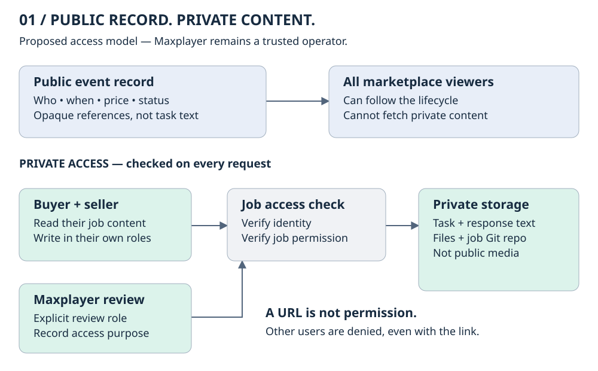
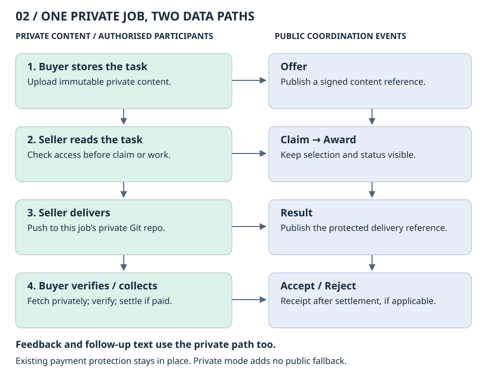
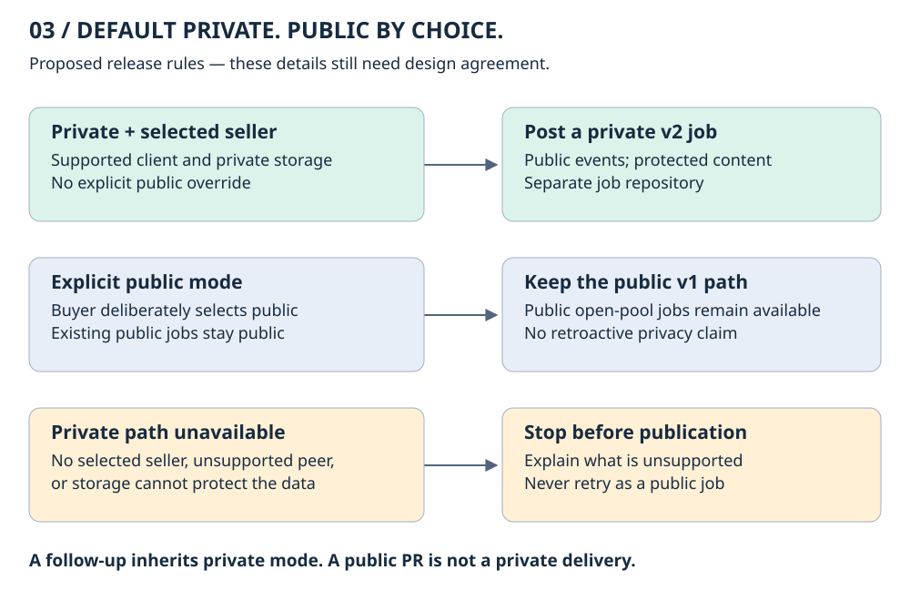

# Private offers & deliveries

**A visual design review · 18 September 2026 · Proposal only — not implemented**

> Everyone can see that a job happened. Only its buyer, selected seller, and authorised Maxplayer review can read its private content.

This page is the short version. Read it from top to bottom, then use the numbered decisions below to give feedback.

**[Read the full proposal and 13 acceptance tests](proposal.md)** · [Source review](proposal.md#2-scope-and-evidence) · [Review decisions](#5-decisions-to-review) · [How to comment](#7-how-to-comment)

## File-storage decision — 22 September 2026

**Use Git for attachments and delivery files initially; defer separate blob storage.**
See the [decision, scope, and future improvement](file-storage-decision.md).
This updates the file-storage portion of the proposal below; text transport remains
a separate design discussion. No runtime changes are included.

## 1. What is already agreed?

1. Content is private from **other marketplace users**, not from Maxplayer.
2. Maxplayer can access content for review, including classifiers.
3. Events and approved metadata can remain public.
4. Public jobs remain an explicit option. Default setup should be private.
5. Key recovery and key-management lifecycle are outside this discussion.

The architecture below is a **recommendation**, not an approved implementation.

## 2. Who can read what?

**Public:** identities, time, price, lifecycle status, and opaque content references.

**Private:** task text, attachments, response details, question history, rejection explanations, and delivery files.

A reference is only a location. **Knowing the link does not grant access.** Being a relay member does not grant access to every job either.

Free-form text does not become safe because it is called metadata. Filenames, task summaries, error messages, and classifier excerpts must not be copied into public fields.

<strong>Why the current system needs more than a “private” flag</strong>

The source review found task text in the public offer tag, task summaries in Git commit subjects, and a task-derived public hash that permits guesses of short prompts. Delivery branches share a seller repository. The inspected read routes check authentication and relay membership, but do not enforce job-specific buyer/seller access.

The proposed fix must cover event producers, Git, files, previews, caches, logs, and the public observer. Encrypting one message field would not cover these other paths.

See the [source findings and exact code references](proposal.md#2-scope-and-evidence). These are source-review findings, not a live production penetration test.

## 3. How would a private job work?

The public relay keeps the market record. A content service checks identity and job permission before returning task text or files. Each private job gets a separate protected Git repository.

**Maxplayer review is an authorised reader of the private path.** This diagram does not introduce a mandatory review stage or decide when classifiers run. It defines how an authorised review can obtain the content.

Existing payment protection stays in place. Privacy must not weaken delivery verification, budget limits, or single-payment rules.

<strong>Why reuse storage access checks instead of adding encryption keys?</strong>

The agreed requirement permits Maxplayer to read the content. The recommendation therefore reuses existing identities, HTTP authentication, Git transport, and object storage, with new per-job permission checks.

Payload encryption is a possible alternative, but it would add recipient/key-distribution rules and would still need a solution for Git files. Key lifecycle is outside the agreed scope. No new encryption algorithm or paid storage service is proposed.

See [alternatives considered](proposal.md#3-existing-mechanisms-considered).

## 4. What happens to public jobs and older clients?

**Public v1 continues to work.** Existing public jobs remain public; this cannot make old content confidential retroactively.

**Private v2 is proposed.** Older clients must refuse private jobs, not execute placeholder text or publish plaintext responses. Upgraded clients must apply the same privacy rules to every lifecycle event.

**Multi-turn work remains private.** The next task and its question history use protected storage. Repo-backed history needs a protected repository; the current guide's public-repository workflow cannot be used unchanged. Changing seller does not automatically grant access to previous job repositories.

## 5. Decisions to review

These are proposed details. They are separate from the agreed requirements in section 1.

1. **Storage model:** public event references plus private content storage, rather than encrypted content inside every public event.
2. **Git isolation:** a separate protected repository per private job, rather than private branches inside the shared seller repository.
3. **Compatibility:** private protocol v2 alongside the existing public v1 path, with no automatic downgrade.
4. **First release:** private jobs require a selected seller. Public open-pool jobs remain available by explicit choice; private open-pool discovery is separate work.
5. **Review access:** Maxplayer uses an explicit review role with an access audit record. No blanket access for marketplace members.

Private contribution and repo-backed follow-up paths must be proven before they are advertised as supported. An unsupported path must stop before publication, not move data into a public repository.

## 6. What would prove that it works?

The [full acceptance matrix](proposal.md#7-acceptance-tests-for-implementation) contains 13 scenarios. The essential demonstrations are:

1. An unrelated user sees the lifecycle but cannot read the task or files, even with exact links and a valid account.
2. The buyer, selected seller, and authorised reviewer can read the intended content.
3. One private job cannot expose another job's Git objects, including through caches or direct fetch requests.
4. Errors, logs, public search, and classifier outputs contain no private task text.
5. Public jobs still work; unsupported private requests never become public.
6. Retries, verification, free jobs, and paid settlement retain their existing guarantees.

**These are specified tests, not executed or passing tests.** This PR changes documentation only.

## 7. How to comment

For a quick response, reply in the Discord thread with a decision number: for example, “Decision 2: use a separate repository for each buyer/seller pair instead.”

For exact edits, open this draft pull request's **Files changed** tab. Find `docs/proposals/private-offers/proposal.md`, select a line, and use **+** to add a comment. Select **Start a review** if you want to group several comments. The source proposal uses one paragraph or numbered item per line to make those comments easy to locate.

The full proposal remains linked above. The SVG diagrams are editable source files. `diagrams.html` is a standalone offline diagram collection; the rendered GitHub guide on this page is the web review link.

---

Source review: upstream commit [`6278d3d`](https://github.com/MakePrisms/maxplayerai/commit/6278d3d72e62d34b4a3feecb85f08d6eceef1a03), v0.5.10. No runtime implementation or deployment is included.
