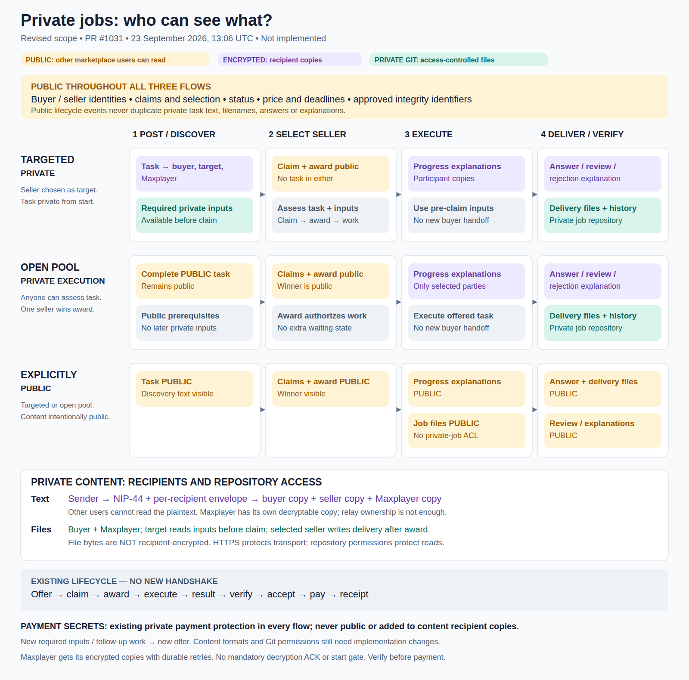

# Private-job visibility flow

**Revised 23 September 2026, following Petar's 13:06 UTC scope approval. Design only; not deployed.**

[Full specification](../private-offers-and-deliveries.md) · [Scope decision](../private-offers-decisions/lifecycle-scope-adjustment.md) · [Decision coverage](../private-offers-decisions/README.md)

[Zoomable SVG](privacy-flow.svg) · [Standalone HTML: download and open in a browser](privacy-flow.html)

## How to read it

- Amber: public content/metadata. Private jobs still reveal identities, lifecycle status and approved commercial/integrity metadata.
- Purple: text encrypted in separate copies for buyer, the relevant seller, and Maxplayer.
- Green: files in an authenticated per-job Git repository. Targeted sellers can read required inputs before claim; only the awarded seller may write deliveries. The file bytes are not recipient-encrypted; transport is protected and serving is access-controlled.
- Gray: execution/availability rules, not another encryption mechanism.

Targeted private jobs supply the complete task and required files before claim. Open-pool jobs supply a complete public task and do not wait for new private buyer inputs after award. Private progress, answers and delivery follow the selected seller. A Maxplayer copy remains mandatory, but a decryption acknowledgment is not an execution prerequisite. Existing verification/payment protection remains in place.

This supersedes the earlier Discord visualization's post-selection private-input boxes and proposed ACK/start gate. It preserves the lifecycle, not compatibility with unchanged wire formats or unchanged Git authorization code.

The PNG was rendered from the standalone HTML with headless Chrome and visually inspected; SVG XML parses successfully. This is a static diagram, not an interactive demo or evidence the feature is implemented. Comment on specific specification lines in [draft PR #1031](https://github.com/MakePrisms/maxplayerai/pull/1031).
